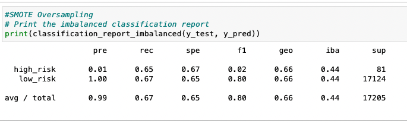
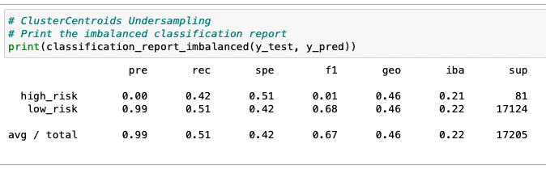
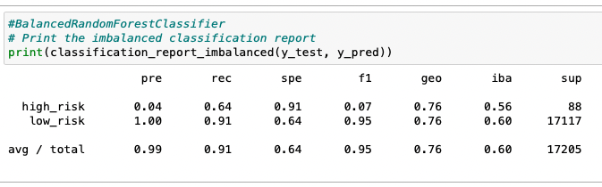
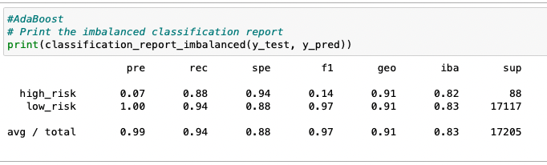

# Credit Risk Analysis Overview

The purpose of this analysis is to identify high risk loans from the provided data set.  This is a particular challenge because the overwhelming majority of loans have a low risk status, specifically 68,470 out of 68,817 total records.  This analysis uses a variety of techniques to address the class imbalance and then examines the performance of each approach.

# Results
Six different techniques were used.  They are listed, along with their balanced accuracy scores and high risk recall rates.
- Random Oversampling: .65, .69
- SMOTE Oversampling: .66, .65
- Cluster Centroid Undersampling: .46, .42
- SMOTEEN Combination Sampling: .59, .63
- Random Forest: .77, .64
- Adaboost: .90, .88

   
   
   

# Summary
The adaptive boost technique performs the best of the techniques tested.  It has the highest balanced accuracy score, best recall and highest f1 scores.  Most importantly it has the highest recall for high risk transactions, correctly identifying 88% of such loans.  In the absence of a better performing alternative, this model should be used to identify high risk transactions.
